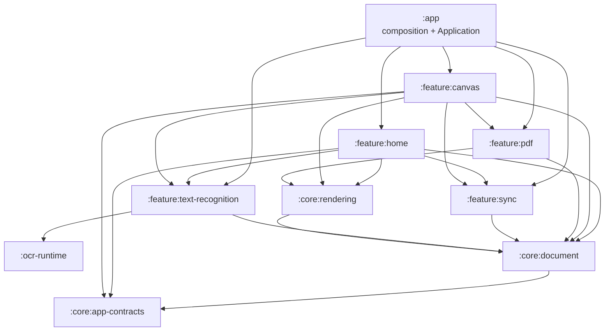

# Notate module architecture

Notate is organized as ten Gradle modules. The module boundary follows ownership: durable document behavior lives below reusable features, feature implementations do not reach into application classes, and `:app` is the composition root.



## Module ownership

| Module | Owns |
|---|---|
| `:app` | `NotateApplication`, concrete navigation wiring, dependency composition, APK packaging, signing, and canonical native-runtime verification |
| `:core:app-contracts` | Application-supplied contracts for navigation and derived document indexing |
| `:core:document` | Canvas/session models, persistence, region storage, serialization, repositories, save worker, preferences, and low-level item renderers needed by persistence |
| `:core:rendering` | Canvas/background/tile rendering, transforms and caches, shared Compose theme, and shared settings panels |
| `:ocr-runtime` | Publishable PP-OCRv3 runtime AAR, model-pack lifecycle, Java/JNI boundary, Paddle Lite/OpenCV native pipeline |
| `:feature:text-recognition` | `TextRecognitionFeature`, stroke rasterization, conversion planning, Room/FTS index, search, indexing workers, and the document-index integration |
| `:feature:pdf` | PDF import/export and `PdfService` |
| `:feature:sync` | Sync providers, preferences, orchestration, `SyncService`, and the `SyncPdfGenerator` port |
| `:feature:home` | Main and note-picker activities, project browser, search UI, settings, and `HomeViewModel` |
| `:feature:canvas` | Canvas activity, Onyx input view, drawing controllers/view model, dialogs, and export coordination |

## Boundary rules

1. `:app` may depend on every module, but feature/core modules never depend on `:app` or its concrete activities.
2. Cross-activity navigation goes through `NotateNavigator`; destinations are data objects in `:core:app-contracts`. The app supplies `AppNotateNavigator`, which is the only place that knows concrete activity classes.
3. Document persistence does not know Room or OCR workers. `CanvasRepository` and `ProjectRepository` call `DocumentIndexIntegration`, supplied by `OcrDocumentIndexIntegration` in `:feature:text-recognition`.
4. Sync does not depend on PDFBox or the PDF feature. It requests derived PDFs through `SyncPdfGenerator`; the app adapts `PdfService` to that port.
5. Home and Canvas use the application-supplied `SyncService`; they do not construct `SyncManager` or reach into its process coordination state.
6. UI code enters OCR through `TextRecognitionFeature`, rather than assembling model managers, predictors, index repositories, and worker schedulers itself.
7. Snapshot goldens and test output belong to the module that owns the behavior. Rendering goldens live in `:core:rendering`; PDF goldens live in `:feature:pdf`.

## Composition and lifecycle invariants

`NotateApplication` provides four process-level integrations through owner interfaces on `Application`: navigation, document indexing, sync orchestration, and sync PDF generation. Each consumer also has a safe no-op/default fallback for tests and non-Notate hosts.

The save-to-index ordering is unchanged by the split:

```text
flush session -> SaveWorker writes the .notate container -> OcrIndexWorker reads the stable session snapshot
```

Shared sessions still use the direct-save path until the final client closes. Delete and rename still invalidate or update the derived OCR index. Sync still opens the same document session and creates PDFs lazily only for providers configured for PDF upload.

## Build and verification

The root build owns common Android library SDK/minimum-SDK/toolchain policy. Module build files retain only feature-specific plugins, Android options, and dependencies.

Run all module unit tests and the aggregate JaCoCo report with:

```bash
./gradlew testDebugUnitTest
./gradlew jacocoTestReport
```

The aggregate XML report is written to `build/reports/jacoco/jacocoTestReport/jacocoTestReport.xml`. Snapshot mismatch artifacts are written beneath the owning module's `build/outputs/snapshots` directory.
