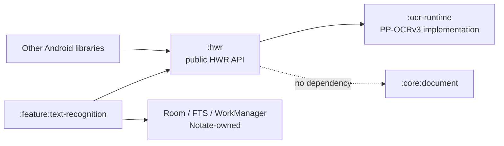

# Handwriting Recognition Wrapper API

<!-- markdownlint-disable MD013 MD060 -->

- Status: Accepted integration contract
- Target: Notebook format v4 release
- Initial Gradle owner: `:feature:text-recognition`
- Package: `com.alexdremov.notate.hwr`

## Summary

The HWR API is the provider-neutral, Android-facing entry point for recognizing text from vector handwriting. It adapts the current PP-OCRv3 bitmap runtime and Google ML Kit Digital Ink behind one host contract with stroke mapping, line grouping, coordinate preservation, candidate comparison, and model lifecycle management.

A consumer supplies strokes and receives recognized text blocks in the same coordinate space. It does not need to know about Paddle Lite, OpenCV, bitmaps, native predictors, model file paths, Notate canvas objects, Room, or WorkManager.

The public API is Kotlin-first, coroutine-native, immutable, and provider-neutral. PP-OCRv3 remains the default Chinese/English provider on ARM64 Android; ML Kit Digital Ink supplies downloadable language models. Provider names appear only as stable IDs and provenance, never as implementation types.

## Why a new boundary is needed

The current code has two useful layers, but neither is the ideal library API:

- `:ocr-runtime` is independently publishable, but its main contract is `PaddleOcrEngine.recognize(Bitmap)`. It exposes Android bitmap input, Paddle-specific names, mutable Android geometry, and model-manager implementation types.
- `:feature:text-recognition` supplies the higher-level handwriting behavior, but depends on Notate's `Stroke`, document persistence, Room search index, preferences, and WorkManager.

The reusable behavior is split across those modules:

| Current responsibility | Current owner | HWR ownership |
|---|---|---|
| Native detector and recognizer | `:ocr-runtime` | Remains an implementation detail |
| Model download, verification, and activation | `:ocr-runtime` | Exposed through a provider-neutral model interface |
| Stroke rasterization | `:feature:text-recognition` | Moves to `:hwr`, using HWR stroke types |
| Tiling and world-coordinate mapping | `:feature:text-recognition` | Moves to `:hwr` |
| Overlap deduplication | `:feature:text-recognition` | Moves to `:hwr` |
| Reading-order text assembly | `:feature:text-recognition` | Moves to `:hwr` |
| Text insertion position | `:feature:text-recognition` | Remains in Notate; it is editor policy |
| Search index, Room, and FTS | `:feature:text-recognition` | Remains in Notate |
| WorkManager scheduling | `:feature:text-recognition` | Remains in the host application |

## Goals

The module must:

1. Let another Android library recognize vector ink with one dependency and one public entry point.
2. Preserve the caller's coordinate system in all result geometry.
3. Produce consistent results for small selections and large documents by owning tiling and deduplication.
4. Make model installation explicit, observable, resumable, and safe.
5. Distinguish an unsupported device, an absent model, and an inference failure.
6. Be safe when multiple libraries in one process use recognition concurrently.
7. Support dependency injection and fakes without loading native code.
8. Expose stable provider and recognition revisions as provenance without invalidating already accepted text.
9. Support explicit runtime provider/model selection and comparison without silent failover.
10. Keep Paddle, OpenCV, JNI, Notate persistence, and UI types out of the public API.

## Non-goals

Version 1 does not:

- provide handwriting capture UI, selection UI, dialogs, toasts, or editor insertion behavior;
- index documents, persist recognition results, or provide full-text search;
- schedule background work or silently download models;
- recognize imported images or arbitrary photographs;
- expose the low-level bitmap OCR API;
- accept Notate `Stroke`, Onyx `TouchPoint`, `android.graphics.RectF`, or `FloatArray` as public model types;
- promise handwriting accuracy or inference latency;
- provide custom model URLs or third-party model loading.

Image OCR remains a separate low-level use case for `:ocr-runtime`. Adding bitmap input to HWR would blur the vector-ink coordinate and rendering contract.

## Terminology

**Handwriting recognition** is conversion of vector ink into text and positioned text blocks. `Hwr` is used in Kotlin identifiers; `HWR` is used only as the module acronym.

**Ink** is an ordered collection of vector strokes in a caller-defined two-dimensional coordinate space.

**Stroke** is an ordered, non-empty sequence of points plus a positive visual width. Color, pen style, pressure, and z-order are not recognition inputs in version 1.

**Handwriting Line** is the host-owned horizontal group of source strokes submitted as one editable recognition unit.

**Recognition Provider** is an interchangeable on-device engine that recognizes a Handwriting Line.

**Recognition Candidate** is provisional provider output. Confidence is nullable because some text providers return ranked candidates without numeric scores.

**Accepted Transcription** is host-owned approved text. It is outside this wrapper and remains valid across provider revision changes.

**Recognition revision** identifies every model, dictionary, preprocessing, threshold, and postprocessing choice that can change output. Consumers use it as part of cache keys.

**Model pack** is the immutable, checksum-pinned set of data files needed by the bundled recognition provider.

## Module boundary



`:hwr` may depend on `:ocr-runtime` with Gradle `implementation`, but must not depend on any `:core:*` or `:feature:*` module. It must also avoid Room, WorkManager, Compose, the Onyx SDK, and Notate serialization.

`:feature:text-recognition` becomes an adapter and product feature. It maps Notate strokes to HWR strokes and continues to own indexing, search, settings, background scheduling, and conversion placement.

## Proposed public API

The following is the normative version 1 surface. Names may be mechanically adjusted during implementation, but the ownership and behavior described here should remain intact.

```kotlin
package com.alexdremov.notate.hwr

import android.content.Context
import kotlinx.coroutines.flow.StateFlow

object Hwr {
    /**
     * Returns the process-wide recognizer. The application context is retained.
     * Repeated calls in the same process return the same logical service.
     */
    @JvmStatic
    fun get(context: Context): HandwritingRecognizer
}

interface HandwritingRecognizer {
    val capabilities: HwrCapabilities
    val models: HwrModelManager

    /**
     * Recognizes vector ink without installing or downloading anything implicitly.
     */
    suspend fun recognize(request: HwrRequest): HwrResult
}

interface HwrModelManager {
    val descriptor: HwrModelDescriptor
    val state: StateFlow<HwrModelState>

    /** Verifies the installed pack and publishes the resulting state. */
    suspend fun refresh(): HwrModelState

    /** Installs the pinned model pack and returns its recognition revision. */
    suspend fun install(): HwrRevision

    /** Removes downloaded model data after in-flight recognition completes. */
    suspend fun remove()
}

data class HwrRequest(
    val strokes: List<HwrStroke>,
    val coordinateSpace: HwrCoordinateSpace = HwrCoordinateSpace(),
    val options: HwrOptions = HwrOptions(),
)

data class HwrCoordinateSpace(
    /**
     * Number of raster pixels per caller coordinate unit.
     * A value of 1 preserves Notate's current canvas-to-raster scale.
     */
    val rasterPixelsPerUnit: Float = 1f,
)

data class HwrStroke(
    val points: List<HwrPoint>,
    val width: Float,
)

data class HwrPoint(
    val x: Float,
    val y: Float,
)

data class HwrOptions(
    val minimumConfidence: Float = 0.5f,
)

data class HwrResult(
    val text: String,
    val blocks: List<HwrBlock>,
    val revision: HwrRevision,
)

data class HwrBlock(
    val text: String,
    val confidence: Float,
    val quadrilateral: HwrQuadrilateral,
) {
    val bounds: HwrBounds
        get() = quadrilateral.bounds
}

data class HwrQuadrilateral(
    val topLeft: HwrPoint,
    val topRight: HwrPoint,
    val bottomRight: HwrPoint,
    val bottomLeft: HwrPoint,
) {
    val bounds: HwrBounds
        get() = HwrBounds(
            left = minOf(topLeft.x, topRight.x, bottomRight.x, bottomLeft.x),
            top = minOf(topLeft.y, topRight.y, bottomRight.y, bottomLeft.y),
            right = maxOf(topLeft.x, topRight.x, bottomRight.x, bottomLeft.x),
            bottom = maxOf(topLeft.y, topRight.y, bottomRight.y, bottomLeft.y),
        )
}

data class HwrBounds(
    val left: Float,
    val top: Float,
    val right: Float,
    val bottom: Float,
)

data class HwrCapabilities(
    val support: HwrDeviceSupport,
    val supportedLanguageTags: Set<String>,
    val supportsRotatedText: Boolean,
    val supportsOfflineRecognition: Boolean,
)

sealed interface HwrDeviceSupport {
    data object Supported : HwrDeviceSupport

    data class Unsupported(
        val reason: HwrUnsupportedReason,
    ) : HwrDeviceSupport
}

enum class HwrUnsupportedReason {
    ANDROID_VERSION,
    CPU_ABI,
    NATIVE_RUNTIME,
}

data class HwrModelDescriptor(
    val packId: String,
    val displayName: String,
    val downloadSizeBytes: Long,
    val supportedLanguageTags: Set<String>,
    val revision: HwrRevision,
)

data class HwrRevision(
    val providerId: String,
    val modelId: String,
    val modelVersion: String,
    val pipelineVersion: Int,
    val dictionaryVersion: String,
) {
    val cacheKey: String
        get() = listOf(
            providerId,
            modelId,
            modelVersion,
            pipelineVersion,
            dictionaryVersion,
        ).joinToString(":")
}

sealed interface HwrModelState {
    data object Checking : HwrModelState
    data object NotInstalled : HwrModelState

    data class Installing(
        val downloadedBytes: Long,
        val totalBytes: Long,
    ) : HwrModelState {
        val progress: Float
            get() = if (totalBytes == 0L) 0f
            else (downloadedBytes.toFloat() / totalBytes).coerceIn(0f, 1f)
    }

    data class Ready(
        val revision: HwrRevision,
        val installedBytes: Long,
    ) : HwrModelState

    data object Removing : HwrModelState

    data class Failed(
        val error: HwrError,
    ) : HwrModelState
}

data class HwrError(
    val code: HwrErrorCode,
    val message: String?,
    val retryable: Boolean,
)

enum class HwrErrorCode {
    UNSUPPORTED_DEVICE,
    MODEL_NOT_INSTALLED,
    MODEL_DOWNLOAD,
    MODEL_VERIFICATION,
    MODEL_ACTIVATION,
    INVALID_INPUT,
    UNSUPPORTED_OPTION,
    NATIVE_INITIALIZATION,
    RECOGNITION,
}

open class HwrException(
    val error: HwrError,
    cause: Throwable? = null,
) : Exception(error.message, cause)
```

Concrete exception subclasses should be supplied for at least unsupported device, missing model, invalid input, model installation, and recognition failure. Callers that only need stable machine behavior may inspect `HwrErrorCode`; UI must not display exception text as localized copy.

### Why the factory returns an interface

Consumers should constructor-inject `HandwritingRecognizer` into their own services. Tests can provide a fake without Android native libraries, files, or network access. `Hwr.get(context)` is only the default composition helper.

The default instance is process-wide because the current native predictor is expensive and not safe to use concurrently. The interface deliberately does not extend `AutoCloseable`: one library must not be able to destroy a predictor shared by another library in the same process.

### Why geometry is owned by HWR

`OcrBlock` currently contains a mutable `FloatArray` and mutable `RectF`. Those are unsafe cache keys, have surprising data-class equality, and couple consumers to Android graphics. HWR geometry is immutable and has structural equality.

The quadrilateral has exactly four named points in clockwise screen order, beginning at the visual top-left. `bounds` is a computed property containing the smallest axis-aligned rectangle around those points, so a consumer cannot construct inconsistent representations.

## Recognition contract

### Input validation

- Every coordinate and width must be finite.
- Every stroke must contain at least one point.
- Stroke width must be greater than zero.
- `rasterPixelsPerUnit` must be finite and greater than zero.
- Coordinates may be negative and may use any unit, provided coordinates and widths use the same unit and `rasterPixelsPerUnit` describes how that unit maps to recognition pixels.
- Input list order is treated as stroke order, but version 1 does not use timing or pressure.
- Request options and coordinate-space metadata are always validated.
- After that validation, an empty stroke list returns an empty result without loading the native runtime.
- Any invalid field throws an input-related `HwrException` before model or native work begins.
- HWR snapshots caller-owned lists at call entry and neither mutates nor retains them.
- Result lists and capability sets are immutable snapshots.

Single-point strokes are rendered as round dots. This preserves dotted letters and punctuation instead of silently discarding them.

An empty result uses `models.descriptor.revision`, even when its model pack is not installed. The descriptor is library metadata and does not require model or native initialization.

### Rasterization and tiling

The default provider renders black, antialiased, round-cap, round-join ink on an opaque white background. Source color and pen style do not affect recognition.

Content bounds are derived from point extents expanded by half of each stroke's width. Callers do not supply cached bounds, which avoids trusting stale geometry and ensures single-point strokes occupy a tile.

The initial implementation retains the current proven geometry:

- 960 by 960 pixel raster/tile size;
- 96 raster-pixel tile overlap;
- 864 raster-pixel stride;
- a grid anchored with `floor(contentStart / stride) * stride`;
- sequential tile processing and immediate bitmap recycling.

Tile size, overlap, and stride in caller units are divided by `rasterPixelsPerUnit`. Stroke widths and points are multiplied by the same scale when rendered. The default value of `1` preserves Notate's current canvas behavior while allowing a consumer whose coordinates are millimeters, density-independent pixels, or another logical unit to declare the intended raster resolution.

The tile constants are implementation details, not public options. Exposing them in version 1 would freeze PP-OCR tuning into a provider-neutral API. `rasterPixelsPerUnit` is public because it defines the input coordinate space rather than tuning the provider. Any implementation change that can alter output must change `HwrRevision.pipelineVersion`.

Large and small requests must use the same tiling path so recognition quality does not depend on whether the caller selected a small region or an entire page.

Sparse ink must not cause a dense scan across the union bounds. The implementation derives occupied tile keys from each stroke's bounds, deduplicates those keys, and processes them in top-to-bottom/left-to-right order. Grid-index calculations must detect numeric overflow, and recognition must check coroutine cancellation between tiles.

### Coordinates

All `HwrBlock` points and bounds are returned in the same coordinate space and units as the input strokes. Raster pixels must never leak into the public result.

Mapping follows:

```text
inputX = tileLeft + bitmapX / rasterPixelsPerUnit
inputY = tileTop  + bitmapY / rasterPixelsPerUnit
```

The contract must be tested with negative origins, non-unit scales, boundary-crossing blocks, and documents larger than one tile.

### Confidence and empty recognition

Confidence is finite and in the inclusive range `[0, 1]`. Blocks with blank text, non-finite confidence, or confidence below `options.minimumConfidence` are omitted.

`minimumConfidence` must be finite and in `[0.5, 1]` for the initial PP-OCRv3 provider. The lower bound reflects the current native and Kotlin filtering floor. A lower value throws an `UNSUPPORTED_OPTION` error rather than pretending to return data the provider already discarded.

No recognized text is a successful result:

```kotlin
HwrResult(
    text = "",
    blocks = emptyList(),
    revision = activeRevision,
)
```

It is not an exception.

### Deduplication and ordering

Overlapping tiles may report the same content more than once. HWR must deduplicate before returning:

1. Prefer the higher-confidence candidate.
2. Compare text after Unicode NFKC normalization, locale-independent lowercase conversion, whitespace collapse, and trimming.
3. Treat near-equivalent strings of at least four code points as candidates when their bounded edit distance is at most `max(1, floor(longerLength / 5))`.
4. Suppress the lower-confidence candidate when intersection-over-union is at least `0.35`.

Returned `blocks` are in reading order for the languages supported by the initial provider. Sort candidates by top coordinate. A block joins the current visual line when the difference between its center Y and the line anchor's center Y is at most `0.55 * max(anchorHeight, blockHeight)`; otherwise it starts a new line. Sort each line from left to right. HWR does not promise right-to-left layout in version 1.

`HwrResult.text` is assembled from the same ordered blocks. Visual lines are separated by `\n`. Within a line, adjacent blocks receive no separator when the left block ends or the right block begins with a Han, Hiragana, Katakana, or Hangul code point; other adjacent blocks receive one space. The final text is trimmed. The block list remains authoritative for consumers that need their own layout policy.

### Model precondition

`recognize` never downloads or installs data. Before non-empty recognition:

1. `capabilities.support` must be `Supported`.
2. `models.state` must identify a verified, ready model pack.
3. Otherwise, a typed HWR exception is thrown without invoking native code.

This lets a host obtain user consent, choose foreground or WorkManager execution, and provide its own localized UI.

## Model lifecycle

The bundled descriptor is immutable. A released pack ID must never later refer to different bytes, URLs, dictionary contents, or checksums.

`install()` must:

1. use only HTTPS, checksum-pinned model sources shipped with the library;
2. enforce expected byte length while streaming;
3. resume safe partial downloads;
4. verify SHA-256 before activation;
5. activate by an atomic same-filesystem rename;
6. remain idempotent when the verified version is already installed;
7. publish byte progress through `state`;
8. reset a previously failed predictor after successful activation.

Cancellation must leave only resumable staging data and must rethrow `CancellationException` unchanged. It must not publish a corrupt or partially active pack.

`refresh()` performs full verification, not only filename and length checks. A quick startup check may choose an initial `Checking` instead of `NotInstalled`, but only checksum verification may publish `Ready`. Recognition must never load the native predictor from a merely structural check.

`remove()` publishes `Removing`, removes the active pack, staging data, and supported legacy locations, waits for an in-flight native call, unloads the predictor, and then publishes `NotInstalled`. Existing results or host-owned indexes are not deleted.

The wrapper performs installation directly and has no WorkManager dependency. A host may call `install()` from its own foreground coroutine or worker.

## Concurrency and cancellation

- Every public method is safe to call from any thread.
- Rasterization and inference never execute on the main thread.
- All default-provider inference calls in a process are serialized around the native predictor.
- Concurrent `install()` calls coalesce into one logical installation and observe the same state.
- Installation and removal are mutually exclusive.
- Once removal begins, new recognition requests fail as model-not-installed; removal waits for the active native call.
- Waiting recognition requests are cancellable.
- `CancellationException` is always propagated unchanged and never wrapped or converted to `Failed`.
- Paddle Lite inference is not interruptible after a native call begins. Cancellation takes effect at the next Kotlin boundary, and the computed result is discarded.
- A failed request must not poison later requests. A native initialization failure may be retained for diagnostics, but a later verified installation must permit reinitialization without process restart.

No FIFO or parallel-throughput guarantee is part of version 1.

## Device and packaging contract

The initial implementation has these runtime constraints:

| Constraint | Version 1 value |
|---|---|
| Minimum Android SDK | 26 |
| Supported ABI | `arm64-v8a` |
| JVM target | 17 |
| Native runtime | Paddle Lite 2.10 |
| Image preprocessing | OpenCV 4.13.0 |
| Languages | Chinese and English |
| Learned angle classifier | Not included |
| Acceleration | CPU only; no NNAPI, OpenCL, QNN, or Hexagon |

`Hwr.get(context)` and capability inspection must be safe on unsupported devices and must not load a native library. Unsupported hardware is reported through `HwrDeviceSupport`; it is not conflated with an absent model.

The artifact declares `android.permission.INTERNET` because the optional installer downloads the model pack. Recognition itself performs no network access. Native libraries and licenses remain packaged with the AAR/APK; model files remain on demand in app-private storage.

The consumer must not need a direct dependency on `:ocr-runtime`, OpenCV APIs, or any Notate module. The published POM must nevertheless carry all runtime transitive dependencies required to package the native implementation.

R8 consumer rules must preserve name-based JNI entry points. A release consumer fixture must verify that the AAR supplies exactly one compatible copy of each required native library and does not create `libc++_shared.so` or OpenCV packaging conflicts.

## Privacy and security

- Recognition is on-device after explicit model installation.
- The wrapper does not contain analytics or telemetry.
- Logs must not contain recognized text, stroke coordinates, model file contents, or caller document identifiers.
- Model sources are immutable and checksum-pinned.
- Redirects to non-HTTPS URLs are rejected.
- Downloaded executable code is prohibited; only model and dictionary data may be installed.
- Files remain in application-private storage.
- Error objects expose stable codes and safe diagnostics, not note content.

The host owns disclosure, user consent, retention, encryption, synchronization, and deletion policy for recognition results.

## Host usage

```kotlin
class SelectionRecognitionService(
    private val recognizer: HandwritingRecognizer,
) {
    suspend fun recognize(strokes: List<MyStroke>): HwrResult {
        val state = recognizer.models.refresh()
        check(state is HwrModelState.Ready) {
            "The host must request model installation before recognition"
        }

        return recognizer.recognize(
            HwrRequest(
                strokes = strokes.map { stroke ->
                    HwrStroke(
                        points = stroke.points.map { HwrPoint(it.x, it.y) },
                        width = stroke.width,
                    )
                },
                coordinateSpace = HwrCoordinateSpace(rasterPixelsPerUnit = 1f),
            ),
        )
    }
}

val recognizer = Hwr.get(applicationContext)

// Run only after host-owned user consent.
recognizer.models.install()

val result = SelectionRecognitionService(recognizer).recognize(selectedStrokes)
showEditableText(result.text)
```

A normal recognition path should not call `refresh()` every time. The example shows the lifecycle explicitly; production hosts may observe `models.state`, refresh once at startup or settings entry, and call `recognize()` directly while ready.

## Notate migration

| Current API or implementation | Migration |
|---|---|
| `PaddleOcrEngine` | Becomes internal to `:ocr-runtime`/`:hwr`; no consumer uses it directly |
| `PaddleLiteOcrEngine` | Default provider implementation behind `HandwritingRecognizer` |
| `PaddleOcrProvider` | Replaced by the process-wide implementation behind `Hwr.get()` |
| `OcrModelPackManager` | Wrapped by `HwrModelManager`; concrete pack/file types stop leaking |
| `OcrModelInfo.indexVersion` | Replaced by `HwrRevision.cacheKey` |
| `OcrBlock` | Adapted internally to immutable `HwrBlock` |
| `StrokeOcrRasterizer` | Moved/reimplemented in `:hwr` against `HwrStroke` |
| `OcrTiledRecognizer` | Moved to `:hwr`; becomes the normal recognition path |
| `OcrBlockDeduplicator` | Moved to `:hwr`, without search-index dependencies |
| `OcrConversionPlanner.orderedText` | Replaced by HWR result ordering and `HwrResult.text` |
| `OcrConversionPlanner.insertionY` | Remains in Notate because it depends on editor/page policy |
| `TextRecognitionFeature.recognize` | Maps Notate `Stroke` objects to `HwrRequest` |
| `TextRecognitionFeature.searchRepository` | Remains a Notate feature concern |
| `OcrModelDownloadWorker` | Continues to call the model interface from host-owned WorkManager code |
| Index workers, Room entities, search normalization | Remain unchanged except for adapting `HwrResult` |

Migration should be staged:

1. Add `:hwr` and its public DTOs/interfaces.
2. Adapt the existing runtime and model manager behind the new interfaces.
3. Move generic rasterization, tiling, deduplication, and ordering with their tests.
4. Add a Notate `Stroke` mapper in `:feature:text-recognition`.
5. Switch manual conversion and background indexing to `HandwritingRecognizer`.
6. Stop exporting implementation types from the wrapper's API surface.
7. Keep the existing `ppocrv3-runtime` coordinate for compatibility until known direct consumers can migrate.

## Versioning

The Maven artifact follows semantic versioning:

- breaking Kotlin/JVM signatures, state semantics, coordinate guarantees, or error-code removal require a major version;
- additive API and backward-compatible capability additions require a minor version;
- implementation fixes that preserve the contract require a patch version.

Recognition output has separate versioning through `HwrRevision`. Any model bytes, dictionary, rasterization, tiling, confidence floor, detector/recognizer configuration, deduplication, coordinate mapping, or reading-order change that can affect output must change a revision component even if the Maven change is only a patch.

The build should enable Kotlin explicit API mode and binary-compatibility validation. Public declarations require KDoc, and public types must be reviewed as long-lived API rather than being exported accidentally by Kotlin's default visibility.

## Verification and acceptance criteria

The wrapper is ready for `1.0.0` when all of the following pass:

### API boundary

- A standalone consumer fixture compiles and runs with only `hwr-android` as its direct dependency.
- The public API dump contains no `Paddle*`, `Ocr*`, OpenCV, Notate model, Onyx, Room, WorkManager, `Bitmap`, `RectF`, `Path`, or mutable array types.
- A fake `HandwritingRecognizer` can be used in a local JVM consumer test without loading Android native code.
- Dependency analysis confirms no edge from `:hwr` to `:core:*` or `:feature:*`.

### Recognition behavior

- Empty input returns an empty result without model or native initialization.
- Invalid width, coordinate, coordinate scale, confidence, or empty point list produces the documented input error.
- Single-point strokes render as dots.
- Result geometry maps back to input coordinates for negative origins and non-unit scales.
- Two far-apart strokes process only their occupied and overlap tiles rather than every intervening tile.
- Small and page-sized requests use the same tiling behavior.
- Tile-overlap duplicates prefer higher confidence and tolerate minor OCR differences.
- Block ordering and `text` reconstruction are deterministic.
- All returned confidence and geometry values are finite.

### Lifecycle and concurrency

- Unsupported ABI, missing model, verification failure, native load failure, and no recognized text remain distinct outcomes.
- Install is checksum-verified, resumable, atomic, idempotent, and cancellable.
- Concurrent installers share progress and do not corrupt staging data.
- Concurrent recognition is serialized without blocking the main thread.
- Removal cannot race predictor use.
- Cancellation is never reported as a recognition or installation failure.
- Successful reinstall recovers from a prior predictor initialization failure.

### Packaging and release

- Debug and R8-minified release consumer apps build for API 26+.
- Required ARM64 libraries are present once; model `.nb` and dictionary files are absent from the AAR.
- JNI bridge classes survive minification.
- License assets and the model manifest are packaged.
- Published sources, POM metadata, and runtime dependencies are correct.
- Physical-device tests cover cold/warm recognition, large ink sets, memory pressure, model interruption/resume, and simultaneous host consumers.

## Deliberately deferred extensions

The version 1 design leaves room for, but does not pre-commit to:

- additional recognition providers or model packs;
- language hints and right-to-left reading order;
- pressure-aware rasterization;
- bitmap/image recognition in a separate OCR API;
- custom host-supplied model storage or download transports;
- accelerator selection;
- a Java `ListenableFuture` facade;
- streaming or incremental recognition.

These should be added only with concrete consumer requirements. The version 1 interface is intentionally small enough to remain stable while the implementation and model quality evolve.
