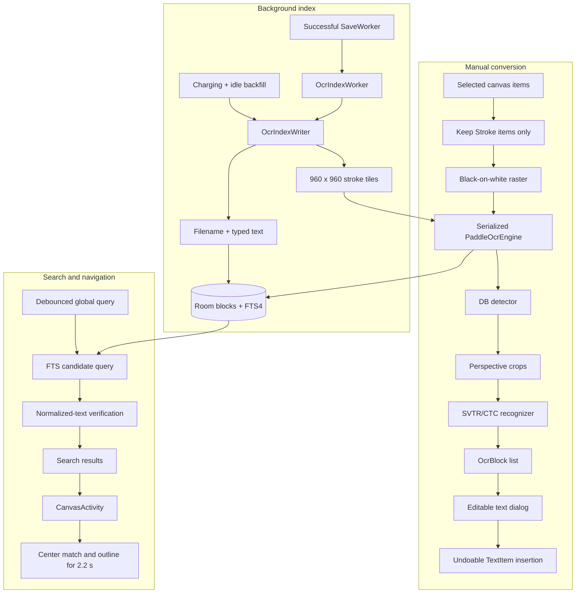

# On-device PP-OCRv3 recognition and search

This document describes the PP-OCRv3 implementation that runs inside Notate on an Android device. It covers the packaged native runtime, stroke rasterization, detector and recognizer pipeline, manual handwriting conversion, background indexing, full-text search, navigation, persistence, failure handling, and device validation.

The document describes the code as implemented. It is not a general PaddleOCR integration guide and it does not describe a server or Python deployment.

## Scope

The implementation is intentionally narrow:

- PP-OCRv3 Chinese mobile text detection and Chinese/English recognition.
- Fully offline inference on 64-bit ARM Android devices.
- CPU inference through Paddle Lite 2.10 with four threads.
- Upright handwritten note content; no learned angle-classification model.
- Manual OCR for selected strokes, producing an editable `TextItem` while preserving the ink.
- Background OCR for saved strokes, producing a device-local, reproducible search index.
- Direct indexing of filenames and existing typed `TextItem` content.

The implementation does not OCR imported images, backgrounds, links, or already-typed text. It does not use a cloud service, download models after installation, or enable QNN, Hexagon, NNAPI, or OpenCL acceleration.

## Architecture at a glance



The manual and background paths share one process-wide [`PaddleLiteOcrEngine`](../app/src/main/java/com/alexdremov/notate/ocr/PaddleLiteOcrEngine.kt). A coroutine `Mutex` serializes all calls into the native predictor, so a background job and a manual selection cannot execute inference concurrently.

## Source map

| Area | Primary implementation |
|---|---|
| Kotlin OCR contract and data objects | [`OcrModels.kt`](../app/src/main/java/com/alexdremov/notate/ocr/OcrModels.kt) |
| Model extraction and verification | [`OcrAssetManager.kt`](../app/src/main/java/com/alexdremov/notate/ocr/OcrAssetManager.kt) |
| Shared inference engine | [`PaddleLiteOcrEngine.kt`](../app/src/main/java/com/alexdremov/notate/ocr/PaddleLiteOcrEngine.kt) |
| Stroke rasterization and coordinate mapping | [`StrokeOcrRasterizer.kt`](../app/src/main/java/com/alexdremov/notate/ocr/StrokeOcrRasterizer.kt) |
| Reading order and converted-text placement | [`OcrConversionPlanner.kt`](../app/src/main/java/com/alexdremov/notate/ocr/OcrConversionPlanner.kt) |
| Java/JNI bridge | [`OCRPredictorNative.java`](../app/src/main/java/com/baidu/paddle/lite/demo/ocr/OCRPredictorNative.java), [`native.cpp`](../app/src/main/cpp/native.cpp) |
| Detector/recognizer orchestration | [`ocr_ppredictor.cpp`](../app/src/main/cpp/ocr_ppredictor.cpp) |
| DB detector postprocessing | [`ocr_db_post_process.cpp`](../app/src/main/cpp/ocr_db_post_process.cpp) |
| Crop and recognition preprocessing | [`ocr_crnn_process.cpp`](../app/src/main/cpp/ocr_crnn_process.cpp) |
| Native build | [`CMakeLists.txt`](../app/src/main/cpp/CMakeLists.txt) |
| Room schema and DAO | [`OcrIndexDatabase.kt`](../app/src/main/java/com/alexdremov/notate/ocr/index/OcrIndexDatabase.kt), [`OcrIndexDao.kt`](../app/src/main/java/com/alexdremov/notate/ocr/index/OcrIndexDao.kt) |
| Incremental index writer | [`OcrIndexWriter.kt`](../app/src/main/java/com/alexdremov/notate/ocr/index/OcrIndexWriter.kt) |
| Query normalization and verification | [`OcrSearchNormalizer.kt`](../app/src/main/java/com/alexdremov/notate/ocr/index/OcrSearchNormalizer.kt), [`OcrSearchRepository.kt`](../app/src/main/java/com/alexdremov/notate/ocr/index/OcrSearchRepository.kt) |
| WorkManager jobs | [`OcrIndexWorker.kt`](../app/src/main/java/com/alexdremov/notate/data/worker/OcrIndexWorker.kt), [`OcrBackfillWorker.kt`](../app/src/main/java/com/alexdremov/notate/data/worker/OcrBackfillWorker.kt) |
| Manual selection UI | [`OnyxCanvasView.kt`](../app/src/main/java/com/alexdremov/notate/ui/OnyxCanvasView.kt), [`SelectionActionPopup.kt`](../app/src/main/java/com/alexdremov/notate/ui/dialog/SelectionActionPopup.kt) |
| Global search UI | [`MainActivity.kt`](../app/src/main/java/com/alexdremov/notate/MainActivity.kt), [`OcrSearchResultsScreen.kt`](../app/src/main/java/com/alexdremov/notate/ui/home/OcrSearchResultsScreen.kt) |
| Settings | [`SettingsDialog.kt`](../app/src/main/java/com/alexdremov/notate/ui/home/SettingsDialog.kt) |
| Packaged versions and checksums | [`MODEL_MANIFEST.json`](../app/src/main/assets/ocr/MODEL_MANIFEST.json) |

## Android packaging

### Supported ABI and toolchain

The application build is restricted to `arm64-v8a` by `abiFilters` in [`app/build.gradle.kts`](../app/build.gradle.kts). The native bridge is compiled as C++17 with CMake 3.22.1 and Android NDK 28.2.13676358. The minimum application SDK is 26.

Restricting the app to ARM64 is important: `PaddleLiteOcrEngine.isAvailable()` requires `arm64-v8a`, and only an ARM64 Paddle Lite shared object is bundled. This build will not install or run as an OCR-capable APK on a 32-bit-only device.

The native build creates `libNative.so` and links it against:

- `libpaddle_light_api_shared.so`
- `libopencv_java4.so`
- Android `jnigraphics`
- EGL and GLESv2, although OpenCL/GPU inference is disabled by configuration
- Android logging

CMake copies the Paddle Lite and OpenCV shared objects into the native output directory so Gradle packages them with `libNative.so`. The app also packages `libc++_shared.so`. The JNI Java classes are protected from R8 renaming/removal in [`proguard-rules.pro`](../app/proguard-rules.pro) because the native entry points use class and method names.

### Bundled runtime and models

The installed APK contains all inference dependencies. No runtime network access is required.

| Artifact | Version/model | Approximate uncompressed size |
|---|---|---:|
| `det_db.nb` | `ch_PP-OCRv3_det_slim_infer.nb` | 1.1 MB |
| `rec_crnn.nb` | `ch_PP-OCRv3_rec_infer.nb` | 10.8 MB |
| `ppocr_keys_v1.txt` | PP-OCR Chinese dictionary with Latin symbols | 27 KB |
| `libpaddle_light_api_shared.so` | Paddle Lite 2.10 | 3.1 MB |
| `libopencv_java4.so` | OpenCV 4.1.0 | 18.3 MB |

These artifacts total roughly 33 MB before APK compression, `libNative.so`, the C++ runtime, and alignment overhead. Actual APK growth depends on the build type and Android packaging.

[`MODEL_MANIFEST.json`](../app/src/main/assets/ocr/MODEL_MANIFEST.json) records upstream locations, versions, SHA-256 values, and a packaging note for the Paddle Lite ELF metadata normalization needed by NDK 28. Licenses for PaddleOCR, Paddle Lite, and OpenCV are included under `app/src/main/assets/ocr/licenses/`.

The model and dictionary files are packaged as Android assets. Paddle Lite needs filesystem paths, so they cannot be used directly from the compressed asset stream.

## Model installation inside the app sandbox

The first inference request calls `OcrAssetManager.prepare()`:

1. Create `<filesDir>/ocr/ppocrv3/` if necessary.
2. Check the SHA-256 of any existing detector, recognizer, and dictionary copies.
3. If a copy is absent or invalid, stream the packaged asset to `<name>.tmp`.
4. Verify the temporary file against a compile-time SHA-256 constant.
5. Delete the invalid destination, if present, and rename the verified temporary file into place.
6. Pass the resulting absolute paths to Paddle Lite.

This makes extraction self-healing after an interrupted or corrupt copy. Model and dictionary content is verified at extraction time. Native library integrity is provided by normal APK signing and installation rather than by `OcrAssetManager`.

Initialization is lazy. Opening a note or the search screen does not load the native predictor by itself; the first actual stroke-recognition request does.

If initialization fails, the engine records the exception in `unavailableReason`. Subsequent `isAvailable()` calls return false for the rest of that process. Restarting the application process permits another initialization attempt after the underlying problem is corrected.

## Inference engine

The Kotlin boundary is:

```kotlin
interface PaddleOcrEngine : AutoCloseable {
    val modelInfo: OcrModelInfo
    suspend fun recognize(bitmap: Bitmap): List<OcrBlock>
    fun isAvailable(): Boolean
}

data class OcrBlock(
    val text: String,
    val confidence: Float,
    val quadrilateral: FloatArray,
    val bounds: RectF,
)
```

`PaddleOcrProvider` owns a process-wide singleton. `recognize()` moves work to `Dispatchers.Default`, locks the engine mutex, lazily loads the predictor, and then performs one detector-plus-recognizer pass.

The configured Paddle Lite options are:

| Option | Value |
|---|---|
| CPU threads | 4 |
| Power mode | `LITE_POWER_HIGH` |
| OpenCL | disabled (`0`) |
| Detector | enabled |
| Learned angle classifier | disabled |
| Recognizer | enabled |
| Maximum detector side | 960 pixels |
| Kotlin result threshold | confidence `>= 0.5` |

This is appropriate for the Snapdragon 750G's ARM64 Kryo CPU. The Adreno GPU and Hexagon DSP are not used. All manual and background inference requests share the same four-thread predictor and queue behind the mutex.

The dictionary is loaded once with a CTC blank marker (`#`) inserted at index 0 and a space appended after the file's entries. Native recognition returns dictionary indexes; Kotlin concatenates valid entries to produce the final string.

## Rasterizing note strokes

PaddleOCR consumes bitmaps, while Notate stores vector strokes in canvas/world coordinates. `StrokeOcrRasterizer` performs the conversion.

For a manual selection:

1. Compute the union of selected stroke bounds.
2. Expand the union by 24 canvas units on every side.
3. Choose `scale = min(1, 960 / max(width, height))`.
4. Create an ARGB_8888 bitmap no larger than 960 pixels on either side.
5. Fill it white.
6. Draw every intersecting stroke in black with its stored width, round caps, round joins, and antialiasing.

The source ink color, pen style, canvas background, images, links, and typed text do not enter the raster. Stroke geometry and width are preserved, but a selection larger than 960 canvas units on its longest side is uniformly downscaled.

For background indexing, the writer supplies an explicit 960 by 960 world-space tile. The same renderer draws only strokes intersecting that tile. Tiles are processed sequentially and each bitmap is recycled immediately after inference.

`OcrRaster.toWorld()` reverses the raster transform for every quadrilateral point:

```text
worldX = tileLeft + bitmapX / scale
worldY = tileTop  + bitmapY / scale
```

It then recomputes an axis-aligned `RectF` from the mapped quadrilateral. These world-space bounds are what the search index stores and what canvas navigation later uses.

## Native detector and recognizer pipeline

### JNI boundary

`OCRPredictorNative` loads `libNative.so` and initializes a native `OCR_PPredictor`. A `long` stores the native pointer in Java. Each call passes an Android `Bitmap` and the flags `run_det=1`, `run_cls=0`, and `run_rec=1`.

The bridge converts the ARGB_8888 bitmap to an OpenCV BGR matrix. Native results are serialized into a flat `float[]` with this repeated record layout:

```text
point_count
word_index_count
recognition_confidence
x0 y0 x1 y1 ...
dictionary_index_0 dictionary_index_1 ...
classifier_label
classifier_confidence
```

Java reconstructs `OcrResultModel` instances before Kotlin maps them to `OcrBlock` objects.

### Detection

The DB detector path:

1. Resizes the image so its longest side is at most 960 pixels.
2. Aligns detector dimensions to multiples of 32.
3. Converts pixels to floats in `[0, 1]`.
4. Applies the detector mean `(0.485, 0.456, 0.406)` and scale `1 / (0.229, 0.224, 0.225)` while converting interleaved pixels to NCHW using NEON code.
5. Runs the Paddle Lite detector.
6. Thresholds the probability map at 0.3, extracts contours, computes minimum-area quadrilaterals, filters low-score or tiny boxes, and expands accepted polygons with an unclip ratio of 2.0.
7. Maps the quadrilaterals back to the original bitmap dimensions.

The native postprocessor limits contour candidates to 1,000, uses a box-score threshold of 0.5, and rejects boxes with a minimum side below 3 pixels.

### Recognition

For every detected quadrilateral, the recognizer:

1. Crops and perspective-rectifies the source image.
2. Geometrically transposes very tall crops whose height is at least 1.5 times their width. This is not the omitted learned angle classifier.
3. Resizes the crop to 32 pixels high with width based on its aspect ratio.
4. Normalizes channels around `0.5` with scale `2.0` and converts to NCHW.
5. Runs the PP-OCRv3 recognition model.
6. Performs greedy CTC decoding, removing blank indexes and repeated adjacent indexes.
7. Averages the chosen nonblank timestep probabilities to produce the recognition confidence.

Kotlin discards blank text, non-finite confidence, and confidence below 0.5. Remaining blocks are initially sorted by top coordinate and then left coordinate.

## Manual “Recognize text” conversion

The selection popup exposes **Recognize text** alongside Copy and Delete. The manual workflow is:

1. Read the current selection without modifying it.
2. Keep only selected `Stroke` objects. Selected images, links, and text items are ignored.
3. Show a progress toast and rasterize on `Dispatchers.Default`.
4. Run the shared OCR engine off the UI thread.
5. Recycle the bitmap in a `finally` block.
6. Sort blocks into approximate visual lines using center-Y overlap, then left-to-right within each line.
7. Open the existing `TextEditDialog` with the recognized content, 24-unit font size, and black text.
8. If the user confirms nonblank text, add one multiline `TextItem` at the selection's left edge.

`OcrConversionPlanner.orderedText()` currently emits one detected block per output line after reading-order sorting. It does not insert spaces to combine multiple detector boxes on the same visual line.

The preferred insertion Y coordinate is 24 canvas units below the selection. On a fixed-page canvas, the planner estimates text height as `lineCount * fontSize * 1.25`. If the text would cross the bottom of the current page, it places the text above the selection and clamps it to that page's top.

The new text box uses the normal 500-unit default width and measured height. Adding it goes through `InfiniteCanvasModel.addItem()`, so the insertion is one normal undoable action. The newly inserted text item is selected for immediate repositioning or resizing.

The original ink is never deleted. Cancelling the editor, confirming blank text, recognizing no text, or encountering an error makes no canvas change.

## Background indexing lifecycle

### After a save

When the last client releases a canvas session, `CanvasRepository.saveAndCloseSession()` flushes the region files and enqueues a unique `SaveWorker`. If background OCR is enabled, it chains `OcrIndexWorker` after that save request:

```text
flush session -> SaveWorker packs .notate container -> OcrIndexWorker reads session directory
```

WorkManager only starts the index worker after `SaveWorker` succeeds. The index worker reads the saved file's current modification time, invokes `OcrIndexWriter`, and retries transient failures with linear backoff. After three retry attempts it returns failure.

If background indexing is disabled before the worker executes, the worker returns success without indexing. A shared session that is not at its final client release uses the repository's direct save path and does not enqueue the chain at that moment; a later final close or charging/idle backfill catches it.

### Charging and idle backfill

`HomeViewModel` schedules one unique `OcrBackfillWorker` when the home UI initializes. The same scheduler is used when indexing is enabled and when the user requests a rebuild.

The backfill requires both:

- device charging
- device idle

It refreshes each configured project's existing file index, deduplicates notes by path, removes OCR database documents whose paths no longer exist, and selects notes when any of these are true:

- no OCR document exists at the path
- the note modification time changed
- the OCR model/index version changed
- the document status is not `INDEXED`

Each invocation processes at most three notes. If more remain, it returns `Result.retry()` and uses a 30-second linear backoff while retaining the charging/idle constraints. Unique work uses `KEEP` normally and `REPLACE` for an explicit rebuild.

An unreadable note is logged and skipped for that pass. A failed note in a final batch is attempted again the next time backfill is scheduled, such as the next home-screen initialization or explicit rebuild.

### Delete, rename, move, and sync

- Deleting a note through `ProjectRepository` immediately deletes its OCR blocks, FTS rows, and document row.
- Renaming updates the document path, display name, and modification time by matching the note UUID. The synthetic filename block is refreshed only when the note is next indexed. Because rename also copies the current modification time into the document row, rename alone may not make backfill consider the note pending; a later save, model-version change, or explicit rebuild guarantees the filename block is refreshed.
- Moves or sync changes are reconciled by backfill. Reopening the same note UUID at a new path updates the existing document identity during indexing.
- Backfill also removes database documents that no longer correspond to a file in any configured project.

## Incremental indexing

### Document identity

The document ID is the note UUID stored in `manifest.bin`. Legacy notes without a UUID fall back to `SHA-256(targetPath)`. The project ID is resolved using the longest matching configured project URI, with an additional Storage Access Framework tree/document comparison for `content://` paths.

The model/index version is:

```text
<model id>:<preprocessing version>:<dictionary version>
```

The current Kotlin value is `ppocrv3-zh-en-mobile:1:ppocr_keys_v1`. It is stored on the document and included in every filename or region hash. Changing any component invalidates prior hashes and makes backfill reprocess the note.

Replacing model bytes without changing `OcrModelInfo.id`, `preprocessingVersion`, or `dictionaryVersion` will not invalidate existing region hashes. Any model, dictionary, threshold, rasterization, or coordinate behavior change that can affect output must bump the relevant version.

`MODEL_MANIFEST.json` records the more specific source label `ppocr_keys_v1-2022-01-18`, while `OcrModelInfo` currently uses `ppocr_keys_v1` as its index-version component. Maintainers should keep these concepts synchronized when updating assets.

### Region hashing and content selection

Each serialized region file is hashed as:

```text
SHA-256(region file bytes || model/index version)
```

If the stored region hash matches, the region is counted as unchanged and is not decoded or recognized. A synthetic `__filename__` region uses the same idea with the note name instead of region bytes.

For a changed region:

1. Decode `RegionProto` from the `.bin` file.
2. Convert every nonblank serialized text record directly to a `TYPED_TEXT` block with confidence 1.0 and its canvas bounds.
3. If strokes exist, decode only those strokes and run OCR.
4. Ignore serialized images, links, and other region content.
5. Atomically replace that region's normal rows and FTS rows.

Typed text is never sent through OCR, so it is not duplicated as handwriting text. A changed mixed region is replaced as one unit: if its stroke OCR fails, the writer retains all previous rows for that region, including its previous typed-text rows, rather than publishing a partial update.

### Background tiling

The stroke union is covered with a fixed grid:

- tile size: 960 by 960 canvas units
- overlap: 96 units
- stride: 864 units
- grid origin: `floor(contentLeft / 864) * 864`, and the equivalent for Y

Empty tiles are skipped. Each populated tile is rendered, recognized, mapped back to canvas coordinates, and recycled before the next tile.

Overlapping tiles can recognize the same line twice. `OcrBlockDeduplicator` sorts candidates by descending confidence and discards a candidate when an already-kept block has:

- the same normalized text, and
- intersection-over-union of at least 0.35

The higher-confidence duplicate wins. Blocks with different recognized strings are retained even if their bounds overlap.

### Stale preservation and cleanup

The document moves through these status values:

| Status | Meaning |
|---|---|
| `INDEXING` | A pass has started. |
| `INDEXED` | Every live region was decoded and indexed successfully. |
| `STALE` | At least one changed region failed; previous searchable rows were retained. |

If region decoding or OCR throws, `OcrIndexWriter` does not call `replaceRegion()` for that region. The previous rows remain searchable, the stale count increments, and the final document row records an explanatory error message.

Removed-region cleanup only runs when the entire pass has no stale regions. This avoids deleting data based on a partial or corrupt session view. The tradeoff is that a stale document can temporarily retain search hits for content that has been removed from the note.

## Room and FTS schema

The database is named `notate_ocr_index.db` and is stored in the application's normal private database directory. It is not part of a `.notate` file and is not synchronized.

The current Room schema version is 1 and schema export is disabled. No fallback-to-destructive-migration option is configured. A future schema change must therefore supply a Room migration or deliberately introduce a reviewed destructive-rebuild strategy for this reproducible index.

### `ocr_documents`

One row per note:

- stable document ID
- project ID
- current path and display name
- source modification time
- model/index version
- status and optional error
- last indexing time

The path is unique and project/status lookups are indexed.

### `ocr_blocks`

One row per filename, typed-text, or recognized-ink block:

- stable content ID
- document and region IDs
- region hash
- source: `FILENAME`, `TYPED_TEXT`, or `INK_OCR`
- original and normalized text
- generated search tokens
- confidence
- optional canvas bounds

Filename bounds are null. Typed and recognized blocks carry world-space bounds.

The stable ID is a hash of document ID, region ID, source, block index, and normalized text. Room still uses an auto-generated integer `rowid` to join each block to FTS.

### `ocr_blocks_fts`

This is an FTS4 table using SQLite's `unicode61` tokenizer. It stores normalized text and generated search tokens, keyed by the corresponding block `rowid`.

Region replacement is a Room transaction: delete old FTS rows, delete old normal rows, insert replacement normal rows, then insert matching FTS rows. The transaction boundary is per region, not one transaction for the entire document pass.

## English and CJK search

### Normalization

Both indexed text and queries use Unicode NFKC normalization, locale-independent lowercase conversion, whitespace collapse, and trimming. NFKC makes width variants such as full-width Latin characters searchable with normal ASCII input.

English/Latin word tokens are sequences of Unicode letters or numbers. Query terms use quoted FTS prefix expressions, so:

```text
hand writ -> "hand"* AND "writ"*
```

The query is generated from parsed tokens rather than interpolated syntax. Punctuation, `OR`, column selectors, and quotes cannot escape into caller-controlled FTS operators.

### CJK tokens

For Han, Hiragana, Katakana, and Hangul text, the normalizer generates both unigrams and adjacent bigrams. Each token is converted to an ASCII-safe value beginning with `z` followed by hexadecimal code points. For example, a two-character query includes two unigram tokens and one bigram token.

The ASCII encoding makes token boundaries deterministic under `unicode61`. CJK query terms are exact quoted tokens rather than prefix expressions.

### Candidate query and verification

FTS is only the candidate generator. `OcrSearchRepository` requests up to twice the desired limit, then verifies each candidate:

- A CJK query must be a normalized substring of the block text or document name.
- Every English query token must prefix at least one normalized candidate token.

This second step prevents unigram/bigram combinations from returning false-positive Chinese matches. Results are deduplicated by document, source, and original text, then capped at 100 by default.

SQL ranks filename blocks before typed text and typed text before handwriting, followed by confidence and note modification time. Search snippets contain at most approximately 100 characters around the raw query match.

## Search UI and canvas navigation

The home toolbar expands to a global **Search all notes** field. `HomeViewModel` cancels the previous query job, waits 150 ms, and searches on `Dispatchers.IO`. A blank query clears the results.

Each result shows:

- note name
- project name when available
- source label: Filename, Typed text, or Handwriting
- a snippet with the first raw, case-insensitive query match highlighted

Opening a result always passes the indexed note path to `CanvasActivity`. Positional results also pass the four canvas bounds as intent extras. After the canvas session and viewport metadata load, `focusSearchMatch()` keeps the current zoom, centers the match, and draws a dashed black rectangle for 2.2 seconds.

Filename results have no bounds and therefore open at the viewport stored in the note metadata.

## Settings and index ownership

Settings → **Text recognition & search** displays:

- the background-indexing switch
- model ID and CPU/architecture summary
- counts of indexed, active, and stale documents
- **Rebuild text index**

Background indexing defaults to enabled. Turning it off prevents new save-chain and backfill work, and workers that start later exit successfully. It does not delete existing index rows or disable searching those rows.

Turning indexing on schedules charging/idle backfill. Rebuild first clears all OCR document, block, and FTS rows, then enqueues replacement backfill. The rebuild button is disabled while background indexing is disabled.

The search database is derived, device-local data and can be rebuilt. It stores recognized and typed text as ordinary, unencrypted SQLite fields within the app sandbox. Clearing the index does not alter any note.

Manual conversion is different: a confirmed `TextItem` is normal canvas content. It is saved into the `.notate` document and participates in the application's normal sync behavior.

## Concurrency, memory, and Snapdragon 750G behavior

The design limits contention on a midrange mobile CPU:

- manual rasterization and inference do not run on the main thread
- background indexing runs through WorkManager
- one mutex serializes all detector/recognizer calls
- background tiles are processed one at a time
- each raster bitmap is recycled after inference
- decoded background `Stroke` objects are recycled after a region finishes
- backfill handles only three notes per invocation

A maximum-size ARGB_8888 raster occupies about 3.5 MiB before OpenCV copies, detector tensors, crops, and native workspace. Peak native memory is therefore higher than the bitmap alone, but tiling avoids holding a full-page bitmap and multiple inference inputs simultaneously.

`LITE_POWER_HIGH` with four threads favors latency over energy use. Backfill's charging/idle constraint limits that cost for old notes, while indexing immediately after a save is unconstrained so a changed note becomes searchable promptly.

There is no hardware-specific branch for the Snapdragon 750G. Compatibility comes from its ARM64 CPU. No claim should be made about the target latency or handwriting accuracy until measurements are run on the physical device.

## Failure behavior and diagnostics

### User-visible behavior

- Empty or non-stroke selection: “Select handwriting to recognize”.
- Degenerate raster bounds: “Selection could not be rendered”.
- No block at confidence 0.5 or higher: “No text recognized”.
- Native/model failure: logged under `PaddleOCR`, followed by “Text recognition is unavailable”.
- Background failure: old rows remain when possible and the document becomes stale.

### Useful log tags

```bash
adb logcat -s PaddleOCR OcrIndex OcrIndexWorker OcrBackfill OCRPredictorNative
```

Paddle Lite and the native bridge also log detector shapes, output sizes, box counts, and per-crop recognition counts. Avoid enabling verbose logs in production if note-content metadata could be sensitive.

### Inspecting a debug installation

Check packaged artifacts:

```bash
unzip -l app/build/outputs/apk/debug/app-debug.apk \
  | rg 'lib/arm64-v8a/(libNative|libpaddle|libopencv)|assets/ocr'
```

List the debug app's extracted model and database directories:

```bash
adb shell run-as com.alexdremov.notate ls -l files/ocr/ppocrv3
adb shell run-as com.alexdremov.notate ls -l databases
```

`run-as` requires a debuggable build and a device that permits it.

Verify repository asset hashes on macOS:

```bash
shasum -a 256 app/src/main/assets/ocr/ppocrv3/*
```

Compare the output with `MODEL_MANIFEST.json` and the constants in `OcrAssetManager`.

## Updating models or preprocessing

Treat a model update as a versioned migration:

1. Obtain the `.nb` model from a trusted upstream release.
2. Confirm it is compatible with the bundled Paddle Lite 2.10 runtime and ARM64 API.
3. Replace the asset and record its exact upstream URL and SHA-256 in `MODEL_MANIFEST.json`.
4. Update the corresponding SHA-256 constant in `OcrAssetManager`.
5. Update bundled licenses if the source or version changes.
6. If the detector, recognizer, dictionary, threshold, rasterization, coordinate mapping, or postprocessing can change output, bump `OcrModelInfo`'s model, preprocessing, or dictionary version.
7. Rebuild and inspect the APK to ensure all native libraries and assets are present only for intended ABIs.
8. Run unit, build, lint, and physical-device validation.
9. Use **Rebuild text index** or rely on model-version backfill to regenerate existing rows.

Do not change only the model asset and checksum: without an `OcrModelInfo` version change, existing matching region hashes will remain valid and old OCR output will not be recomputed.

## Automated verification

Run the repository checks with:

```bash
./gradlew :app:testDebugUnitTest
./gradlew :app:assembleDebug
./gradlew :app:lintDebug
```

OCR-focused tests cover:

- raster-to-canvas coordinate mapping
- overlap deduplication and confidence preference
- top/left reading order
- fixed-page insertion fallback
- NFKC/case/whitespace normalization
- safe English prefix queries
- CJK unigram/bigram generation
- FTS operator escaping
- native SQLite FTS storage for Chinese substring candidates
- preservation of previous region rows when the model is unavailable
- save-to-index WorkManager chaining

The tests are in:

- [`OcrGeometryTest.kt`](../app/src/test/java/com/alexdremov/notate/ocr/OcrGeometryTest.kt)
- [`OcrSearchNormalizerTest.kt`](../app/src/test/java/com/alexdremov/notate/ocr/OcrSearchNormalizerTest.kt)
- [`OcrIndexWriterTest.kt`](../app/src/test/java/com/alexdremov/notate/ocr/OcrIndexWriterTest.kt)
- [`CanvasRepositoryWorkTest.kt`](../app/src/test/java/com/alexdremov/notate/data/CanvasRepositoryWorkTest.kt)

## Physical-device release validation

Automated JVM and build checks do not validate handwriting quality, native behavior under Android memory pressure, thermals, or Snapdragon 750G latency. Before enabling the feature in a release, test at least 25 labeled English and 25 labeled Chinese stylus samples on the target device.

The intended acceptance gates are:

| Metric | Target |
|---|---:|
| Normalized character accuracy, English | at least 85% |
| Normalized character accuracy, Chinese | at least 85% |
| Warm five-line manual recognition | under 1.5 s |
| Cold five-line manual recognition | under 3 s |
| One A4 handwritten page indexed | under 10 s |
| Search P95 with 10,000 blocks | under 150 ms |
| Visible canvas/UI stalls | none |

Also verify:

- first-run asset extraction and second-run reuse
- manual cancellation and undo/redo
- fixed-page insertion near both page edges
- concurrent save indexing and manual recognition
- process death during save, index, and rebuild
- missing or corrupt model copies
- corrupt note regions and stale-row retention
- deletion and rename cleanup
- charging/idle backfill resumption
- model-version invalidation
- search navigation at multiple zoom levels
- long sessions for thermal throttling and memory stability

These physical-device gates have not been established by the PP-OCRv3 paper and are not automatically enforced by the app. The current preference defaults background indexing to enabled. If the Snapdragon 750G handwriting gate fails, release configuration or product policy must disable the feature until the model is improved; the runtime does not silently substitute another OCR model.

## Current limitations

- The recognizer is a scene-text model, not a model proven specifically for stylus handwriting.
- Only ARM64 devices are supported by this build.
- Manual selection OCR downscales one large selection instead of tiling it; very large selections lose detail.
- Background OCR covers strokes only. Imported-image OCR is not implemented.
- The learned angle classifier is omitted; note content is expected to be upright.
- Conversion emits one detector block per line rather than reconstructing spaces within a visual line.
- Deduplication requires identical normalized text, so slightly different overlap recognitions can both remain.
- Disabling background indexing preserves existing searchable rows.
- Rename metadata updates immediately, but rename alone can leave the synthetic filename FTS block under the old name until a later save or explicit rebuild.
- A stale mixed region retains both old OCR and old typed-text rows until that region can be fully rebuilt.
- The index is app-private but not encrypted separately from Android's application sandbox.
- There is no accelerator path or per-device performance auto-tuning.
- Native inference is not interruptible once a predictor call has started; coroutine cancellation takes effect around calls, not inside Paddle Lite execution.

These constraints are deliberate or explicit in the current code and should be revisited through separate, measured changes rather than hidden runtime substitutions.
